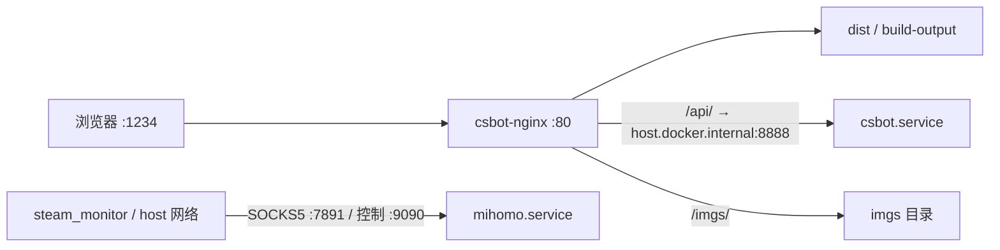

# CSBot 服务器服务清单

本文由原 `csbot/SERVER_SERVICES.md` 移入部署仓库根目录，并于 **2026-09-27（Asia/Shanghai）** 通过 `ubuntu@cgserver` 只读核查。生产目录位于 `/home/ubuntu`。执行前阅读 [AGENTS.md](AGENTS.md)，日常发布见 [DEPLOY.md](DEPLOY.md)。

## 2026-09-27 AI 改造上线记录

15:48 CST 完成用户授权的 DSH/Mneme 生产切换；前后端已跟踪文件干净，未更新 Steam Monitor。代码通过 GitHub 和 `pull --ff-only` 发布。

| 组件 | 已上线版本 |
| --- | --- |
| 后端 `/home/ubuntu/csbot`（首次切换） | `4a8f1cdb75523b12033b8ebbaa7185a3d5f62f1b` |
| 前端源码 | `bbc325cb213975c0e6278104d32cb3c830269d69` |
| 前端产物 `/home/ubuntu/csbot/dist` | `3f39da006f755d516c03d4263782485a159ae41e` |
| Node / DSH / Mneme | `22.22.0` / `0.1.5-rc.3` / `0.8.8` |
| 隔离脚本镜像 | `csbot-ai-python:1`，`sha256:565a6cb9849e94c02c3cd5598ad03cd1afb148e77ecd6d400fbd0fc2f504ed80` |

- 安装 `/etc/systemd/system/csbot.service.d/ai.conf`；用户单独明确授权 `SupplementaryGroups=docker` 的宿主高权限。沙箱不挂 Docker socket。原 `memory.conf` 保留，守护 timer 已恢复 active。
- 数据库一致性备份、原版本、环境及 systemd 快照保存在服务器私有目录 `/home/ubuntu/backups/ai-rollout-20260927-1545`。PostgreSQL custom dump 约 108 MiB，`pg_restore --list` 校验成功。图片用同文件系统硬链接快照，状态目录另行复制；**备份仍持有已淘汰旧原图的磁盘块，所以原图缓存缩小不等于同等空间已释放**。不要在未确认回滚窗口结束前删除备份。
- 发布前原图约 7.1 GiB。上线后缓存统计为 **1,000,916,357 字节（约 955 MiB）**，低于 1 GiB；既有 **12,001 张缩略图全部保留**。旧下载缓存仍有约 49 MiB 未登记文件，按既定规则保留，没有任意清空目录。
- `csbot.service` active、NRestarts=0，前端 HTTP 200、后端路由探测 404；六个业务容器继续运行。QQ 连接日志已观察到，Steam `ok/loggedOn/friendStatusReady=true`。
- 现有令牌通过线上认证；独立网页会话真实调用 DSH → Docker Python，完成 1..100 求和并返回 5050；任务 completed，工具审计可取、推理字段隐藏，个人历史 200、未知归属记录 404。该验收不查询群资料、不向 QQ 群发送消息；实际 QQ 群收发仍由正常使用确认。
- 验收后服务内存约 592 MiB，整机可用约 1592 MiB；cgroup OOM/oom_kill 均为 0。磁盘约剩 2.2 GiB，包含上述回滚备份和独立验收目录占用。这些是上线后的短时快照。

### 16:01 默认群友人设修正

- 后端通过 GitHub/ff-only 更新至 `1f3e8ec810a54f5d79270b52adf9fac5634cace1` 并重启，前端版本不变。默认个性按用户选择设为直爽犀利、爱接梗和吐槽；日常回复省略内部编号、秒级时间，明确追问时提供必要原始值。系统提示、本轮风格与 DATA.md 保持一致。
- 线上独立个人会话完成三轮真实生成：连败吐槽、合成战绩口语回答、追问 mid/精确开赛时间。战绩回答未泄露夹具编号与精确时间；追问返回指定 mid 和时间，未附带 record_id。未查询真实群资料、未向 QQ 发消息。
- 重启后 `csbot/mihomo/docker` 与内存守护 timer 均 active，NRestarts=0；前端 200、后端探测 404，Steam 三项就绪布尔值均 true，六个容器保持运行。已跟踪文件干净。

## 2026-09-27 内存保护发布记录

14:45 CST 已发布后端 `739decb849b89dc49070be1cb7f954e3d6676dd9`，包含流式聊天检索修复 `14ea96b` 和内存守护；未发布进行中的 AI/图片/前端修改。通过 GitHub 推送和服务器 `pull --ff-only` 更新，线上已跟踪文件干净。

- `csbot-memory-guard.timer` 已启用并运行，验证了后续每分钟自动采样；策略和回退见 [部署手册](DEPLOY.md#后端内存保护)。
- 首次真实触发原因为后端内存达到阈值：14:44:55 服务 cgroup 占用 **1688.4 MiB**、整机可用 **232.4 MiB**；14:45:34 完成重启和 HTTP 探测，用时约 39 秒。旧进程停止仍触发 30 秒超时，由 systemd 清理后恢复。
- 启动初期占用 451 MiB；14:46:40 预热后服务 cgroup 占用 **858.6 MiB**、整机可用 **1602.0 MiB**。这是短时观测，不能据此确认内存泄漏或长期稳定性。
- 实际 cgroup `memory.max=1887436800`（1800 MiB）、`memory.oom.group=1`；本次观察 `oom=0`、`oom_kill=0`。后端、Mihomo、Docker 正常，六个业务容器仍运行，前端 HTTP 200、后端探测 HTTP 404，Steam `ok/loggedOn/friendStatusReady=true`。
- 在干净本地检出及生产机上，10 项守护安全测试和 3 项流式检索单测通过，systemd 模板校验通过。检索修复另由对应任务在 `csbot_backup` 完成 24,939 条候选的 recency/BM25 验证；本次未在生产库跑测试，也未发送 QQ 验收消息。

## 当日内存保护发布前的只读快照

- Ubuntu 22.04 LTS，内核 `5.15.0-106-generic`。
- `mihomo.service`、`docker.service`、`csbot.service` 均为 `active`、`enabled`；后端本轮 systemd 统计重启数为 0。
- 六个业务容器均运行；`steam_monitor` 为 `healthy`，健康接口 HTTP 200、`loggedOn=true`、`friendStatusReady=true`。
- `/ai-chat` 静态页面经 1234 端口返回 HTTP 200；本轮未使用用户令牌验证受保护 API，也未验证 QQ 发消息、TeamSpeak 通话或数据库读写。
- 线上后端与 Steam Monitor 的 commit 分别与本次文档迁移前的子模块一致。后续文档提交已更新本地子模块版本，不代表线上已发布。三个部署配置文件的 SHA-256 与本地一致：`csbot/docker-compose.yml`、`csbot/assets/default.conf`、`steam_monitor_js/compose.yaml`。

| 代码/产物 | 线上分支 | 核查时 commit |
| --- | --- | --- |
| `/home/ubuntu/csbot` | `main` | `3be0cbbe5a4885bf488a50f62839a5199624492c` |
| `/home/ubuntu/csbot/dist` | `build-output` | `84da643f743cbe69b798350407f2569e8cef5548` |
| `/home/ubuntu/steam_monitor_js` | `main` | `f4f444620a9cd2f852cc42da57bb2412ebded2d7` |

前端本地源码子模块为 `ac51abb1b84feb05176128f3544bde7826045c75`。源码与构建产物分属不同分支；本轮未查询 GitHub Actions 以证明两者的对应关系。

### 请求流向



### 实际监听与挂载

| 服务 | 镜像或管理方式 | 宿主机监听 | 持久化/配置来源 |
| --- | --- | --- | --- |
| 后端 | systemd + uv | `0.0.0.0:8888` | `/home/ubuntu/csbot/.env.prod` |
| Nginx | `nginx:alpine` | 所有地址 TCP 1234 → 容器 80 | `assets/default.conf`、`dist/`、`imgs/` |
| PostgreSQL | `postgres:15-alpine` | 所有地址 TCP 5432 | `pg_data/` |
| Adminer | `adminer` | 所有地址 TCP 8081 → 容器 8080 | 无持久卷 |
| NapCat | `mlikiowa/napcat-docker:latest` | 所有地址 TCP 6099 | `napcat/config/`、`ntqq/` |
| Steam Monitor | `steam-monitor-js:latest` | `127.0.0.1:5555`，host 网络 | 自身 `.env`、`data/`，只读挂载 Mihomo resources |
| TeamSpeak | `teamspeak:latest` | host 网络，TCP 10011、30033 | `/home/ubuntu/ts/data` |
| Mihomo | systemd | 回环 TCP 7890、7891、7893；通配地址 TCP 9090、1053 | `/home/ubuntu/clashctl/resources/runtime.yaml` |

此表为宿主机观察结果，不代表公网可达；本轮未审计云安全组、防火墙或 UDP。旧文档把控制端口写成仅回环不符合当前监听，客户端仍通过 `127.0.0.1:9090` 访问。

### 当前文档覆盖差异

- Docker 除仓库中的 `mihomo.conf` 外还有 `/etc/systemd/system/docker.service.d/http-proxy.conf`，设置 `HTTP_PROXY`、`HTTPS_PROXY`、`NO_PROXY`；本轮只确认变量名，未导出配置值。
- 后端除仓库中的 `proxy.conf` 外还有 `/etc/systemd/system/csbot.service.d/success-exit.conf`，内容包含 `SuccessExitStatus=143`。后端主 unit 使用 `Restart=on-failure`、`RestartSec=5`。
- 后端主 unit、以上两个额外 drop-in、TeamSpeak Compose 和 Mihomo 运行配置尚未纳入本父仓库模板；新机器恢复前需从原机备份。
- 后端已有未跟踪的 `analysis_outputs/`、`data/`、`dist/`、NapCat 会话目录及分析脚本；Steam Monitor 有环境文件备份。已跟踪文件未发现修改，但未跟踪目录不能删除。
- `csbot/scripts/stop.sh` 仍按 `bot.py` 名称强杀进程，`bak.sh` 针对旧 MySQL，`sync.sh` 指向旧 `root@myecs`；均不作为现行生产流程。`copy_db.sh` 创建测试库并导入，属于数据变更操作，不是健康检查。

## 证据来源

本轮使用 `systemctl show/cat`（选择性输出）、`docker ps`、`docker compose ls`、`docker inspect`（仅网络、重启策略和挂载）、`ss -ltn`、Git 版本/状态、配置哈希及 HTTP 检查。未拉取代码、重启服务或更改生产配置；未导出环境密钥。运行状态为核查时快照。

## 启动顺序

1. `mihomo.service`
   - 路径：`/home/ubuntu/clashctl`
   - HTTP 代理：`127.0.0.1:7890`
   - SOCKS5 代理：`127.0.0.1:7891`
   - 控制接口访问地址：`127.0.0.1:9090`；当前实际监听为通配地址。
   - Git、CSBot 的 `CS_PROXY` 和 Steam Monitor 都依赖它。
2. `docker.service`
   - systemd drop-in 声明 Docker 在 mihomo 之后启动；另有 HTTP 代理 drop-in。
   - 各容器通过 `restart: unless-stopped` 或 `restart: always` 自动恢复。
3. CSBot Compose 项目：`/home/ubuntu/csbot/docker-compose.yml`
   - `csbot-database`：PostgreSQL，端口 5432。
   - `csbot-nginx`：前端静态文件和反向代理，端口 1234。前端没有单独运行时服务。
   - `csbot-napcat`：QQ/NapCat，端口 6099。
   - `csbot-adminer-1`：Adminer，端口 8081。
4. Steam Monitor Compose 项目：`/home/ubuntu/steam_monitor_js/compose.yaml`
   - 容器：`steam_monitor`。
   - 使用 host 网络，API 为 `127.0.0.1:5555`。
   - 使用 mihomo 的 SOCKS5 端口 7891 和控制端口 9090。
5. TeamSpeak Compose 项目：`/home/ubuntu/ts/docker-compose.yml`
   - 容器：`teamspeak_server`。
   - 使用 host 网络，端口 10011 和 30033 等由 TeamSpeak 直接监听。
6. `csbot.service`
   - 工作目录：`/home/ubuntu/csbot`。
   - 启动命令：`/home/ubuntu/.local/bin/uv run python bot.py`。
   - 后端监听端口 8888。
   - 主 unit 声明在 Docker 之后启动，drop-in 声明在 mihomo 之后启动；这些依赖不等于服务已就绪。

## 首次安装 systemd 文件

以下是在已有生产目录布局的服务器上安装后端仓库附带的三个文件。它不是全新机器的一键安装：需先恢复 `csbot.service` 主 unit、Docker HTTP 代理配置和后端 `success-exit.conf`，并安装 uv、Docker、Mihomo 及恢复配置/数据。文档虽然移至父仓库根目录，模板仍在后端仓库 `deploy/systemd/`。

```bash
cd /home/ubuntu/csbot
sudo install -m 0644 deploy/systemd/mihomo.service /etc/systemd/system/mihomo.service
sudo install -d /etc/systemd/system/docker.service.d /etc/systemd/system/csbot.service.d
sudo install -m 0644 deploy/systemd/docker.service.d/mihomo.conf /etc/systemd/system/docker.service.d/mihomo.conf
sudo install -m 0644 deploy/systemd/csbot.service.d/proxy.conf /etc/systemd/system/csbot.service.d/proxy.conf
sudo systemctl daemon-reload
sudo systemctl enable mihomo.service docker.service csbot.service
```

## 重启后恢复

```bash
sudo systemctl start mihomo.service
sudo systemctl start docker.service
sudo docker compose -f /home/ubuntu/csbot/docker-compose.yml up -d
sudo docker compose -f /home/ubuntu/steam_monitor_js/compose.yaml up -d
sudo docker compose -f /home/ubuntu/ts/docker-compose.yml up -d
sudo systemctl restart csbot.service
```

不要在 mihomo 尚未监听 7890/7891 时执行依赖代理的 Git 拉取或重启 Steam Monitor。Steam Monitor 具备自动恢复能力，但错误的启动顺序会造成一段时间的 `unhealthy` 和指数退避。

## 健康检查

```bash
systemctl is-active mihomo.service docker.service csbot.service
ss -ltnp | grep -E ':7890|:7891|:9090|:1234|:5555|:6099|:8888'
sudo docker compose -f /home/ubuntu/csbot/docker-compose.yml ps
sudo docker compose -f /home/ubuntu/steam_monitor_js/compose.yaml ps
sudo docker compose -f /home/ubuntu/ts/docker-compose.yml ps
curl -fsS --max-time 5 http://127.0.0.1:5555/api/health
curl -fsS --max-time 10 http://127.0.0.1:1234/ai-chat -o /dev/null
journalctl -u mihomo.service -u csbot.service -n 100 --no-pager
```

Steam Monitor 应显示 `healthy`，其 `/api/health` 应包含 `loggedOn=true` 和 `friendStatusReady=true`。`csbot-nginx` 提供前端，`csbot.service` 提供后端 API，两者都正常时 AI 页面才完整可用。

## 迁移时必须保留

- `/home/ubuntu/csbot/.env.prod`
- `/home/ubuntu/csbot/pg_data`
- `/home/ubuntu/csbot/imgs`
- `/home/ubuntu/csbot/napcat` 和 `/home/ubuntu/csbot/ntqq`
- `/home/ubuntu/csbot/dist` 和 `/home/ubuntu/csbot/assets/default.conf`
- `/home/ubuntu/clashctl/resources`、`/home/ubuntu/clashctl/bin/mihomo` 和代理配置
- `/home/ubuntu/steam_monitor_js/.env`、`/home/ubuntu/steam_monitor_js/data` 和 `compose.yaml`
- `/home/ubuntu/ts/data` 和 `/home/ubuntu/ts/docker-compose.yml`
- `/etc/systemd/system/mihomo.service`
- `/etc/systemd/system/docker.service.d/mihomo.conf`
- `/etc/systemd/system/docker.service.d/http-proxy.conf`
- `/etc/systemd/system/csbot.service` 及 `/etc/systemd/system/csbot.service.d`

后端还存在 `/home/ubuntu/csbot/data` 和服务器本地分析脚本，迁移前确认其用途并一并备份。数据库应使用一致性备份或停机备份，不直接把运行中的 `pg_data` 当作可恢复备份；Steam SQLite 与令牌文件也须保持一致。密钥和配置通过安全渠道迁移，不提交到仓库。

迁移后先恢复数据和环境文件，再安装 systemd 文件、启动 mihomo、启动 Docker Compose 项目，最后启动 `csbot.service`。

## 后端内存保护配置

配置入口见 [部署手册：后端内存保护](DEPLOY.md#后端内存保护)。部署后应保留：

- `/usr/local/lib/csbot-memory-guard.py`
- `/etc/systemd/system/csbot-memory-guard.service` 与 `.timer`
- `/etc/systemd/system/csbot.service.d/memory.conf`

模板仍在后端仓库 `scripts/` 与 `deploy/systemd/`。守护任务的 `/run/csbot-memory-guard/guard.lock` 仅为运行时锁，无需备份。日志通过 `journalctl -u csbot-memory-guard.service` 查看；是否安装及启用以实时 `systemctl` 查询为准，不由模板存在推断。

## 索引维护

历史聊天索引重建会降低进程优先级，并批量写入。生产环境必须使用 transient systemd service 限制资源，仍应在业务低峰执行：

```bash
sudo systemd-run \
  --unit=csbot-chat-index-rebuild \
  --description='Low-impact CSBot chat image index rebuild' \
  --property=WorkingDirectory=/home/ubuntu/csbot \
  --property=Nice=15 \
  --property=CPUQuota=80% \
  --property=MemoryHigh=1300M \
  --property=MemoryMax=1500M \
  --property=IOWeight=10 \
  /home/ubuntu/csbot/.venv/bin/python \
  /home/ubuntu/csbot/scripts/rebuild_chat_history_groups.py
```

通过以下命令观察进度和前端响应，不要并行启动第二个重建任务：

```bash
systemctl status csbot-chat-index-rebuild.service --no-pager
journalctl -fu csbot-chat-index-rebuild.service
curl -sS -o /dev/null -w 'http=%{http_code} total=%{time_total}s\n' --max-time 10 http://127.0.0.1:1234/ai-chat
```
