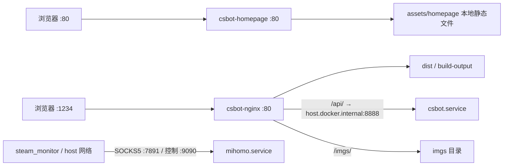

# CSBot 服务器服务清单

## 2026-10-03 斗鱼监控修复上线

- 后端 `e1af04ad26e129bfa397a462acfa7eacd6287d70` 已推送 GitHub，完成本地与服务器独立工作区验收后，在用户明确授权“上线”后经生产 `pull --ff-only` 发布。15:10（Asia/Shanghai）重启后端，MainPID `1839772`、`NRestarts=0`；插件启动成功。验收见 [DELIVERY_CHECK.md](DELIVERY_CHECK.md#2026-10-03-斗鱼开播与回放监控修复)。无前端改动、依赖新增或数据库迁移。
- 生产数据库名单仍为 `dy_6979222`、`bili_1883358196`、`bili_1912788102`、`bili_84074`。`6979222` 是玩机器实际房间 ID，`6657` 是同房间靓号，未修改监控名单。旧实现因 `doseeing.com` 于 2026-09-30 停服，访问房间页被重定向到只有一个标题的公告页，取第二个标题时报 IndexError 并跳过房间。
- 修复读取斗鱼官方开播与回放字段，且过滤明确标注重播的标题。上线后 15:11 的只读实测仍确认 `2267291` 平台回放与 `100` 标题重播都为 replay/0，`9999` 真直播为 live/1，玩机器的真实 ID 与靓号均为 offline/0；具体维护入口与边界见 [部署手册](DEPLOY.md#斗鱼直播监控)。请求错误不会写成下播，状态命令显示“查询失败”。未向真实 QQ 群发送测试消息。
- 发布前 AI 运行/排队 0、pending/sent 发件箱 0，已有失败发件箱 1 条。原后端 commit、服务与容器快照及 AI 状态库在线备份位于 `/home/ubuntu/backups/douyu-live-20261003-zfmtrb`，SQLite `integrity_check=ok`，备份后磁盘约 11050 MiB 可用。内存守护 timer 在重启期间暂停后已恢复。
- 发布后后端/mihomo/docker/内存守护 timer active，7 个容器正常运行且 ID 与发布前相同，前端 HTTP 200，后端不存在路由探测 404，Steam `ok/loggedOn/friendStatusReady` 均 true；生产已跟踪文件干净。
- 15:12:01–15:12:08 首轮自然定时监控成功读取玩机器、CS-advent、cbyybccbyybc、炫神_，四项均为 0；无直播抓取报错，数据库 `dy_6979222` 状态为 0。后端 PID 未变、`NRestarts=0`。此自然执行验证了运行中插件，而非仅验证独立接口探测脚本。

## 2026-10-02 个人主页改为本地静态托管

- 配置版本 `23a0d042129ee689a055acac3b929abb0d61fec5` 已推送 GitHub 并经生产 `pull --ff-only` 发布。将原站的 1250 字节 HTML 保存为 `csbot/assets/homepage/index.html`，只读挂载到 `csbot-homepage`，由 80 端口直接返回本地文件；移除逐次请求 GitHub Pages 的反向代理。文件 SHA256 与原站相同，页面内无外部脚本或图片。
- 发布前代理本机请求耗时样本为 0.71–3.11 秒，公网单次样本约 1.79 秒。无外网临时容器的静态内容验收和 Nginx 配置校验通过；14:05（Asia/Shanghai）上线后本机三次请求约 0.8–1.1 毫秒，公网三次 HTTP 200 约 61–69 毫秒，正文与已保存原站一致；缺失路径直接返回本地 404。以上是本轮观测，不是持续延迟保证。
- 仅重建 `csbot-homepage`，原六个容器 ID 保持，后端 PID `1235523`、`NRestarts=0` 保持。Mihomo、Docker、后端与内存守护 timer active，CSBot 前端 200、后端路由探测 404，Steam 三项就绪 true；生产已跟踪文件干净。
- 原代理配置、Compose、commit 与运行快照保存在 `/home/ubuntu/backups/homepage-static-20261002-8GRrvF`。后续原站更新须先同步本地静态文件，再按 [部署手册](DEPLOY.md#80-端口个人主页) 的 Git 流程发布。

## 2026-10-02 80 端口个人主页首版上线（已改为本地静态托管）

- 后端仓库配置版本 `cf0f9ffc82d5a8b6db8c86a25a9a55f4b9d0b0ee` 已推送 GitHub 并在生产 `pull --ff-only`。新增 Compose 服务 `homepage` / 容器 `csbot-homepage`，宿主机 IPv4/IPv6 80 端口反向代理到 `https://juruocjl.github.io/`；公开入口为 `http://42.193.244.178/`。模板位于 `csbot/assets/homepage.conf`，启动策略为 `unless-stopped`，沿用已安装的 Nginx 1.29.4 镜像。
- 本地 Compose 校验和服务器临时隔离容器的 `nginx -t` 通过；上线容器再次通过配置校验。13:58（Asia/Shanghai）从本机公网请求得到 HTTP 200、1250 字节，响应正文与原 GitHub Pages 页面逐字一致，SHA256 均为 `982fa41eba468f9f83149be6b7976196a7bb3522941d8db312372d144d0f3172`。UFW 原本 inactive，公网验收通过，未修改防火墙或云安全组。
- 仅启动新增首页容器。原六个业务容器 ID 均保持，后端 PID `1235523`、`NRestarts=0` 与发布前一致；Mihomo、Docker、后端和内存守护 timer 均 active，CSBot 1234 前端 HTTP 200、后端不存在路由探测 404，Steam `ok/loggedOn/friendStatusReady` 均 true。生产已跟踪文件干净；无后端重启、前端构建或数据维护。
- 原 Compose 配置、后端 commit、容器与后端运行快照保存在 `/home/ubuntu/backups/homepage-port80-20261002-5vcVFj`。入口更新和停用步骤见 [部署手册](DEPLOY.md#80-端口个人主页)。

## 2026-10-01 @ 对象历史显示名（atv2）上线

- 后端 `73e4e63dfb9cd35994df45511d69f649b5544e5e` 已推送 GitHub，并在生产以 `pull --ff-only` 发布。新收到或发出的群消息仅为可见的被 @ 对象保存当时群内显示名；AI 查询和对话记录以 `@当时昵称([at:QQ号])` 展示。旧 `at` 仍可读，旧历史不回填；本次无前端改动或数据库迁移。
- 发布前运行/排队任务和待发送发件箱均为 0；AI 状态库在线备份通过 `integrity_check`，原后端版本记录在 `/home/ubuntu/backups/ai-atv2-20261001-xeGXxf`。本地合成消息与 `csbot_backup` 验收见 [DELIVERY_CHECK.md](DELIVERY_CHECK.md)，未向真实 QQ 群发送测试消息，也未将新格式写入生产库作测试。
- 发布后生产跟踪文件干净、源码白名单检查通过；后端、内存守护、Mihomo、Docker 均 active，后端 `NRestarts=0`，六个容器运行，前端 HTTP 200、后端路由探测 404，Steam 健康 `ok/loggedOn/friendStatusReady` 均为 true，磁盘约 12 GiB 可用。尚需由后续真实 @ 消息验证当时的群名片获取情况。
- 日志中的 `plugins/live_watcher/__init__.py:get_live_status` `IndexError` 在本次重启前已每两分钟出现，重启后仍出现；此周期任务的既有错误未包含在本次 atv2 修改中，不能据此认定直播监控功能正常。

## 2026-09-30 历史原图读取修复上线

- 后端 `ba596d7fd4f0df0ce3a9dc757435253b6161cdcc` 经 GitHub、独立 Linux 真实模型验收后，生产 `pull --ff-only` 发布。历史 JPEG/GIF/WebP 原图若沿用 `.png` 文件名，图片查询在本轮给 DSH 提供与实际编码匹配的临时只读视图；归档文件本身和数据库未迁移。提示要求 `available` 时先读原图，不能由较小的模型预览推断归档只剩缩略图。
- 对会话 `fada27b9-b4b9-4fa1-ac1f-3e840fe4024e` 的实际归档文件做生产路径核验：临时 `.jpg` 视图与原图同 inode，Pillow 识别 JPEG、1170×2532，原归档大小和 inode 不变。未重跑真实 QQ 对话，也未声称已经读出图内文字。合成图真实模型验收见 [DELIVERY_CHECK.md](DELIVERY_CHECK.md)。
- 发布前 AI 运行/排队与 pending/sent 发件箱均 0；状态库 SQLite 备份及原后端版本位于 `/home/ubuntu/backups/ai-image-read-20260930-0oZsP0`，备份 integrity_check 通过。发布后后端/内存守护/mihomo/docker active、NRestarts=0，六容器运行，前端 HTTP 200、后端路由探测 404，Steam 三项就绪 true，生产跟踪文件干净，磁盘约 12 GiB 可用。未向 QQ 群发送测试消息。

## 2026-09-29 群成员头像读取路由修复

- 后端`5b4c9f5db2e4ec6a792e51249939fe0880702f7d`经GitHub与生产`pull --ff-only`上线。一次历史会话`1a11308d-9ad3-4186-a607-5e645d771cfe`将QQ头像URL误传给仅接收本地文件的`read_image`，未调用已存在的`member_avatar`，因此把路径错误说成权限不足。现在每轮提示及DATA.md给出明确顺序，URL误用时工具返回正确路径说明；普通回答不附内部字段或文件路径。没有新增模型工具、改权限、改数据库结构或旧会话内容。
- Linux独立验收副本使用合成群成员和合成头像、现有DeepSeek测试配置，实测`member_avatar → read_image`成功，回答图像内容且未泄露工具字段；本地DSH协议与群知识边界回归通过。此次未从真实QQ群重新请求该成员头像，实际成员状态和CDN可达性仍以将来真实调用为准，不能把合成通过描述为那张头像已看过。
- 发布前AI运行/排队和pending/sent发件箱均0。AI状态库备份经SQLite integrity_check，原版本记录在`/home/ubuntu/backups/ai-avatar-route-20260929-mwltBq`。后端/内存守护active，MainPID=106080、NRestarts=0；六容器运行，前端HTTP200、后端路由探测404，Steam三项就绪true，生产跟踪文件干净，磁盘可用约12 GiB。没有向QQ群发送测试消息。

## 2026-09-29 自我话题语气调整上线

- 后端`31e950b353f76bb30668569c7bcc56872ea7095e`经GitHub和生产`pull --ff-only`发布。仅增加自我话题的轻微傲娇语气，保留DeepSeek身份/虚拟形象与事实回答规则；不改前端、依赖、群记忆或数据库结构。
- 发布前AI运行/排队和pending/sent发件箱均0；AI状态库一致性备份、原版本记录位于`/home/ubuntu/backups/ai-self-tone-20260929-TMoTt1`。后端和内存守护已恢复active，后端MainPID=29922、NRestarts=0；六容器运行，前端HTTP200、后端路由探测404，Steam三项就绪true，生产跟踪文件干净。
- 临时会话真实模型回放曾出现虚拟尾巴威胁玩笑，收紧提示后再测已收敛；详细样本见[DELIVERY_CHECK.md](DELIVERY_CHECK.md)。没有向真实QQ群发送测试消息，不能将单次回放视为每次生成保证。

## 2026-09-29 DeepSeek 身份与虚拟形象上线

- 后端`71703ea08c39c51f91ff3c256dd23f35c5d430d1`经GitHub和生产`pull --ff-only`发布；系统提示明确其为DeepSeek模型驱动的群友，虚拟形象为蓝色长发、蓝白女仆装、鲸鱼尾巴。具体模型标识每轮从运行配置注入，不主动反复自我介绍，也不把形象当成真实身体或经历。没有改前端、DSH/Mneme依赖、数据库结构或既有记忆。
- 发布前AI运行/排队与pending/sent发件箱均0；已用SQLite在线备份并校验AI状态库，位于`/home/ubuntu/backups/ai-identity-20260929-r306wB/state-before.sqlite3`，原后端commit在同目录`backend-before.txt`。停后端与内存守护后更新代码、启动后端并恢复守护；未向QQ群发送测试消息。
- 本地DSH协议和真实模型临时会话验收见[DELIVERY_CHECK.md](DELIVERY_CHECK.md)。线上csbot/mihomo/docker/内存守护timer均active，后端MainPID=27126、NRestarts=0，六容器运行；前端HTTP200、后端路由探测404，Steam三项就绪true；生产跟踪文件干净，磁盘可用约12 GiB。没有用真实QQ群对话验收措辞。

## 2026-09-27 磁盘清理与日志限额

- 清理前根盘约40 GiB、使用率98%、可用870 MiB；完成后使用率69%、可用12,783,632,384字节（约11.91 GiB），本轮合计释放约11 GiB。未重启后端或业务容器。
- journal从约4.0 GiB降至432 MiB，释放约3.5 GiB；此前未显式配置容量限制。后端配置提交`90876e03cd9a7dbb3dd4c8f81798cde62c6013d0`已推送并经生产`pull --ff-only`部署，安装`/etc/systemd/journald.conf.d/60-csbot-retention.conf`，重启journald生效：总量512 MiB、单文件64 MiB、最长14天、尽量留空2 GiB。容量上限可能缩短保留时间，活跃文件/轮转有少量额外占用。
- 清理13个无标签且无容器引用的旧镜像，以及超过24小时的构建缓存、APT下载缓存。Docker镜像共享层不能按镜像标称大小相加；单独image prune曾显示释放0B，后续builder prune释放约1.006GB，根盘实测在删除旧原图前由870 MiB增至约5.8 GiB。有标签镜像（包括现用及回滚AI隔离镜像）、容器和卷均保留。uv缓存清理因运行中进程持锁而取消，没有强制清理。
- 用户明确确认永久删除“仅备份持有的旧大图”。在`/home/ubuntu/backups/ai-rollout-20260927-1545/image-history/full`内逐文件检查普通文件、硬链接数为1，并在删除前复核inode/设备/大小/块数；共删除10,453张、释放6,583,996,416字节（约6.13 GiB），保留1,548张共享大图。私有清理清单位于该备份根目录`expired-originals-cleanup-20260927-221151.json`。**此首次上线备份已不含被淘汰原图的完整高清历史**；其数据库、环境和其他状态备份仍保留。现有大图LRU、小图、聊天记录、记忆和其他备份未清理。
- 本次排查中备份独立统计约8.8 GiB，先遍历业务目录后统计则约7.6 GiB，差异来自共享硬链接，不代表数据突增。大图LRU早已生效，但备份一直持有已淘汰图片的块。QQ自身数据约2.9 GiB、PostgreSQL约2.0 GiB、测试环境及游戏目录均按业务数据保留。
- 验收：journald/csbot/mihomo/docker/内存守护timer均active，后端PID仍3556082、NRestarts仍31，六个容器运行；前端200、后端路由探测404，Steam三项就绪true。只读核对上轮记忆修复与旧手工记忆通过，生产已跟踪文件干净。未向QQ发送测试消息。

## 2026-09-27 原生网页工具与语境记忆修复发布

- 后端 `14b37c9aca82bb8f46bd1cc612ad92fe3873a6dd` 已通过GitHub、独立Linux验收、生产`pull --ff-only`上线。启用DSH原生搜索/网页读取，重组交流指令与Mneme提炼/保存核验；未改前端、Steam Monitor、依赖锁或Docker镜像。生产模型保持`deepseek-flash`，候选对比未证明值得切换。
- 发布前排队/运行AI及pending/sent发件箱均0。群832126798新增2条公开来源核实的zdbk/Celechron词典，保留原话新增1条澄清，原生forget停用1条把引用按字面解读的旅游行程。未推断在校身份，未批量清洗记忆；与备份逐字段核对旧`legacy-ai-mem-explicit`原文未变。维护回执确认4个动作及原生搜索成功，线上鉴权记忆API验收通过。
- 本次完整AI备份：`/home/ubuntu/backups/pragmatics-code-20260927-6Jd8HR/ai.tar.gz`，原后端版本在同目录`backend-before.txt`。定向维护备份：`/home/ubuntu/backups/pragmatics-memory-correction-20260927/`，含`scope.tar.gz`、`state.sqlite3.gz`、`memory-before.db`、`plan.json`、`receipt.json`。恢复时先在独立目录解包核对，再按停服/状态锁流程恢复；不直接覆盖运行中的数据。
- 发布中发生启动中断：未预留新增备份空间，preflight以“少于800 MiB可用磁盘”拒绝启动。没有降低启动门槛；新备份无损压缩后仍不足，自动审批拒绝动旧备份，用户明确授权后，将上一轮`/home/ubuntu/backups/image-metadata-20260927-M2iGAX/ai`改为同目录`ai.tar.gz`。所有归档逐文件SHA256校验（含符号链接目标）后才释放未压缩副本，内容保留；追加压缩本次独立SQLite备份，恢复后可用约870 MiB。DEPLOY.md补上备份后余量检查。
- 最终csbot/mihomo/docker/内存守护timer active，HTTP前端200、后端路由探测404，6容器运行，Steam三项就绪true。后端约707 MiB；启动失败期间systemd累计`NRestarts=31`，恢复后的两次检查计数未增加。生产跟踪文件干净，未发送QQ验收消息。此次中断及语义回放失败样例没有计为验收通过。


## 2026-09-27 统一图片语义归档发布

- 后端 `3f7e8a9792892fac95293a8f497db9706a23c96d` 已经GitHub、`pull --ff-only`发布并重启。图库pic/mgz使用校验资源引用；网页/HTML数据图、趋势图和词云附带历史快照；统一发送层剥离metadata后才发送QQ。AI独有图、表情图与未知来源保留原图，异常/超限快照回退原图。
- 发布前AI队列与pending/sent发件箱均为空。AI状态和原版本备份位于 `/home/ubuntu/backups/image-metadata-20260927-M2iGAX`；没有数据库结构迁移、历史数据改写或图片清理。前端、Steam Monitor及容器配置未更新。
- 发布后csbot/mihomo/docker/内存守护timer均active，NRestarts=0，后端内存快照约747MiB；前端200、后端探测404，六个容器继续运行，Steam三项就绪均true。源码映射校验及受保护只读API验收通过，已跟踪生产文件干净。

## 2026-09-27 回答依据修复

- 后端发布至 `b6c550b18995c67e87a6fb27452b15c25e3857c6`，恢复被 profile 配置覆盖的完整系统提示，并明确查证后仍未知应直接说明，不能用接梗或猜测代替解释。前端与 Steam Monitor 版本未变。
- 生产发布前无排队/运行中的 AI，完整 AI 状态与原版本备份位于 `/home/ubuntu/backups/answer-evidence-20260927-bja9O2`。经 GitHub、`pull --ff-only` 发布并重启，内存守护恢复；未改业务数据库、未改历史回复、未向 QQ 发送验收消息。
- 发布完成后 `csbot/mihomo/docker/csbot-memory-guard.timer` active，NRestarts=0，后端内存快照约 633 MiB；前端 HTTP 200，后端路由探测 404；六个容器保持运行，Steam 三项就绪为 true。受保护只读记忆 API 与权限拒绝验收通过，生产已跟踪文件干净。

本文由原 `csbot/SERVER_SERVICES.md` 移入部署仓库根目录，并于 **2026-09-27（Asia/Shanghai）** 通过 `ubuntu@cgserver` 只读核查。生产目录位于 `/home/ubuntu`。执行前阅读 [AGENTS.md](AGENTS.md)，日常发布见 [DEPLOY.md](DEPLOY.md)。

## 2026-09-27 AI 改造上线记录

15:48 CST 完成用户授权的 DSH/Mneme 生产切换；前后端已跟踪文件干净，未更新 Steam Monitor。代码通过 GitHub 和 `pull --ff-only` 发布。

| 组件 | 已上线版本 |
| --- | --- |
| 后端 `/home/ubuntu/csbot`（首次切换） | `4a8f1cdb75523b12033b8ebbaa7185a3d5f62f1b` |
| 前端源码 | `bbc325cb213975c0e6278104d32cb3c830269d69` |
| 前端产物 `/home/ubuntu/csbot/dist` | `3f39da006f755d516c03d4263782485a159ae41e` |
| Node / DSH / Mneme | `22.22.0` / `0.1.5-rc.3` / `0.8.8` |
| 隔离脚本镜像 | `csbot-ai-python:1`，`sha256:565a6cb9849e94c02c3cd5598ad03cd1afb148e77ecd6d400fbd0fc2f504ed80` |

- 安装 `/etc/systemd/system/csbot.service.d/ai.conf`；用户单独明确授权 `SupplementaryGroups=docker` 的宿主高权限。沙箱不挂 Docker socket。原 `memory.conf` 保留，守护 timer 已恢复 active。
- 数据库一致性备份、原版本、环境及 systemd 快照保存在服务器私有目录 `/home/ubuntu/backups/ai-rollout-20260927-1545`。PostgreSQL custom dump 约 108 MiB，`pg_restore --list` 校验成功。图片用同文件系统硬链接快照，状态目录另行复制；**备份仍持有已淘汰旧原图的磁盘块，所以原图缓存缩小不等于同等空间已释放**。不要在未确认回滚窗口结束前删除备份。
- 发布前原图约 7.1 GiB。上线后缓存统计为 **1,000,916,357 字节（约 955 MiB）**，低于 1 GiB；既有 **12,001 张缩略图全部保留**。旧下载缓存仍有约 49 MiB 未登记文件，按既定规则保留，没有任意清空目录。
- `csbot.service` active、NRestarts=0，前端 HTTP 200、后端路由探测 404；六个业务容器继续运行。QQ 连接日志已观察到，Steam `ok/loggedOn/friendStatusReady=true`。
- 现有令牌通过线上认证；独立网页会话真实调用 DSH → Docker Python，完成 1..100 求和并返回 5050；任务 completed，工具审计可取、推理字段隐藏，个人历史 200、未知归属记录 404。该验收不查询群资料、不向 QQ 群发送消息；实际 QQ 群收发仍由正常使用确认。
- 验收后服务内存约 592 MiB，整机可用约 1592 MiB；cgroup OOM/oom_kill 均为 0。磁盘约剩 2.2 GiB，包含上述回滚备份和独立验收目录占用。这些是上线后的短时快照。

### 16:01 默认群友人设修正

- 后端通过 GitHub/ff-only 更新至 `1f3e8ec810a54f5d79270b52adf9fac5634cace1` 并重启，前端版本不变。默认个性按用户选择设为直爽犀利、爱接梗和吐槽；日常回复省略内部编号、秒级时间，明确追问时提供必要原始值。系统提示、本轮风格与 DATA.md 保持一致。
- 线上独立个人会话完成三轮真实生成：连败吐槽、合成战绩口语回答、追问 mid/精确开赛时间。战绩回答未泄露夹具编号与精确时间；追问返回指定 mid 和时间，未附带 record_id。未查询真实群资料、未向 QQ 发消息。
- 重启后 `csbot/mihomo/docker` 与内存守护 timer 均 active，NRestarts=0；前端 200、后端探测 404，Steam 三项就绪布尔值均 true，六个容器保持运行。已跟踪文件干净。

## 2026-09-27 内存保护发布记录

14:45 CST 已发布后端 `739decb849b89dc49070be1cb7f954e3d6676dd9`，包含流式聊天检索修复 `14ea96b` 和内存守护；未发布进行中的 AI/图片/前端修改。通过 GitHub 推送和服务器 `pull --ff-only` 更新，线上已跟踪文件干净。

- `csbot-memory-guard.timer` 已启用并运行，验证了后续每分钟自动采样；策略和回退见 [部署手册](DEPLOY.md#后端内存保护)。
- 首次真实触发原因为后端内存达到阈值：14:44:55 服务 cgroup 占用 **1688.4 MiB**、整机可用 **232.4 MiB**；14:45:34 完成重启和 HTTP 探测，用时约 39 秒。旧进程停止仍触发 30 秒超时，由 systemd 清理后恢复。
- 启动初期占用 451 MiB；14:46:40 预热后服务 cgroup 占用 **858.6 MiB**、整机可用 **1602.0 MiB**。这是短时观测，不能据此确认内存泄漏或长期稳定性。
- 实际 cgroup `memory.max=1887436800`（1800 MiB）、`memory.oom.group=1`；本次观察 `oom=0`、`oom_kill=0`。后端、Mihomo、Docker 正常，六个业务容器仍运行，前端 HTTP 200、后端探测 HTTP 404，Steam `ok/loggedOn/friendStatusReady=true`。
- 在干净本地检出及生产机上，10 项守护安全测试和 3 项流式检索单测通过，systemd 模板校验通过。检索修复另由对应任务在 `csbot_backup` 完成 24,939 条候选的 recency/BM25 验证；本次未在生产库跑测试，也未发送 QQ 验收消息。

## 当日内存保护发布前的只读快照

- Ubuntu 22.04 LTS，内核 `5.15.0-106-generic`。
- `mihomo.service`、`docker.service`、`csbot.service` 均为 `active`、`enabled`；后端本轮 systemd 统计重启数为 0。
- 六个业务容器均运行；`steam_monitor` 为 `healthy`，健康接口 HTTP 200、`loggedOn=true`、`friendStatusReady=true`。
- `/ai-chat` 静态页面经 1234 端口返回 HTTP 200；本轮未使用用户令牌验证受保护 API，也未验证 QQ 发消息、TeamSpeak 通话或数据库读写。
- 线上后端与 Steam Monitor 的 commit 分别与本次文档迁移前的子模块一致。后续文档提交已更新本地子模块版本，不代表线上已发布。三个部署配置文件的 SHA-256 与本地一致：`csbot/docker-compose.yml`、`csbot/assets/default.conf`、`steam_monitor_js/compose.yaml`。

| 代码/产物 | 线上分支 | 核查时 commit |
| --- | --- | --- |
| `/home/ubuntu/csbot` | `main` | `3be0cbbe5a4885bf488a50f62839a5199624492c` |
| `/home/ubuntu/csbot/dist` | `build-output` | `84da643f743cbe69b798350407f2569e8cef5548` |
| `/home/ubuntu/steam_monitor_js` | `main` | `f4f444620a9cd2f852cc42da57bb2412ebded2d7` |

前端本地源码子模块为 `ac51abb1b84feb05176128f3544bde7826045c75`。源码与构建产物分属不同分支；本轮未查询 GitHub Actions 以证明两者的对应关系。

### 请求流向



### 实际监听与挂载

| 服务 | 镜像或管理方式 | 宿主机监听 | 持久化/配置来源 |
| --- | --- | --- | --- |
| 后端 | systemd + uv | `0.0.0.0:8888` | `/home/ubuntu/csbot/.env.prod` |
| Nginx | `nginx:alpine` | 所有地址 TCP 1234 → 容器 80 | `assets/default.conf`、`dist/`、`imgs/` |
| 个人主页 Nginx（2026-10-02 新增） | `nginx:alpine` | 所有地址 TCP 80 → 容器 80 | `assets/homepage.conf`、`assets/homepage/`，只读挂载；本地静态文件 |
| PostgreSQL | `postgres:15-alpine` | 所有地址 TCP 5432 | `pg_data/` |
| Adminer | `adminer` | 所有地址 TCP 8081 → 容器 8080 | 无持久卷 |
| NapCat | `mlikiowa/napcat-docker:latest` | 所有地址 TCP 6099 | `napcat/config/`、`ntqq/` |
| Steam Monitor | `steam-monitor-js:latest` | `127.0.0.1:5555`，host 网络 | 自身 `.env`、`data/`，只读挂载 Mihomo resources |
| TeamSpeak | `teamspeak:latest` | host 网络，TCP 10011、30033 | `/home/ubuntu/ts/data` |
| Mihomo | systemd | 回环 TCP 7890、7891、7893；通配地址 TCP 9090、1053 | `/home/ubuntu/clashctl/resources/runtime.yaml` |

此表为宿主机观察结果，不代表公网可达；本轮未审计云安全组、防火墙或 UDP。旧文档把控制端口写成仅回环不符合当前监听，客户端仍通过 `127.0.0.1:9090` 访问。

### 当前文档覆盖差异

- Docker 除仓库中的 `mihomo.conf` 外还有 `/etc/systemd/system/docker.service.d/http-proxy.conf`，设置 `HTTP_PROXY`、`HTTPS_PROXY`、`NO_PROXY`；本轮只确认变量名，未导出配置值。
- 后端除仓库中的 `proxy.conf` 外还有 `/etc/systemd/system/csbot.service.d/success-exit.conf`，内容包含 `SuccessExitStatus=143`。后端主 unit 使用 `Restart=on-failure`、`RestartSec=5`。
- 后端主 unit、以上两个额外 drop-in、TeamSpeak Compose 和 Mihomo 运行配置尚未纳入本父仓库模板；新机器恢复前需从原机备份。
- 后端已有未跟踪的 `analysis_outputs/`、`data/`、`dist/`、NapCat 会话目录及分析脚本；Steam Monitor 有环境文件备份。已跟踪文件未发现修改，但未跟踪目录不能删除。
- `csbot/scripts/stop.sh` 仍按 `bot.py` 名称强杀进程，`bak.sh` 针对旧 MySQL，`sync.sh` 指向旧 `root@myecs`；均不作为现行生产流程。`copy_db.sh` 创建测试库并导入，属于数据变更操作，不是健康检查。

## 证据来源

本轮使用 `systemctl show/cat`（选择性输出）、`docker ps`、`docker compose ls`、`docker inspect`（仅网络、重启策略和挂载）、`ss -ltn`、Git 版本/状态、配置哈希及 HTTP 检查。未拉取代码、重启服务或更改生产配置；未导出环境密钥。运行状态为核查时快照。

## 启动顺序

1. `mihomo.service`
   - 路径：`/home/ubuntu/clashctl`
   - HTTP 代理：`127.0.0.1:7890`
   - SOCKS5 代理：`127.0.0.1:7891`
   - 控制接口访问地址：`127.0.0.1:9090`；当前实际监听为通配地址。
   - Git、CSBot 的 `CS_PROXY` 和 Steam Monitor 都依赖它。
2. `docker.service`
   - systemd drop-in 声明 Docker 在 mihomo 之后启动；另有 HTTP 代理 drop-in。
   - 各容器通过 `restart: unless-stopped` 或 `restart: always` 自动恢复。
3. CSBot Compose 项目：`/home/ubuntu/csbot/docker-compose.yml`
   - `csbot-database`：PostgreSQL，端口 5432。
   - `csbot-nginx`：前端静态文件和反向代理，端口 1234。前端没有单独运行时服务。
   - `csbot-homepage`：个人主页静态文件，端口 80；文件位于 `assets/homepage/`。
   - `csbot-napcat`：QQ/NapCat，端口 6099。
   - `csbot-adminer-1`：Adminer，端口 8081。
4. Steam Monitor Compose 项目：`/home/ubuntu/steam_monitor_js/compose.yaml`
   - 容器：`steam_monitor`。
   - 使用 host 网络，API 为 `127.0.0.1:5555`。
   - 使用 mihomo 的 SOCKS5 端口 7891 和控制端口 9090。
5. TeamSpeak Compose 项目：`/home/ubuntu/ts/docker-compose.yml`
   - 容器：`teamspeak_server`。
   - 使用 host 网络，端口 10011 和 30033 等由 TeamSpeak 直接监听。
6. `csbot.service`
   - 工作目录：`/home/ubuntu/csbot`。
   - 启动命令：`/home/ubuntu/.local/bin/uv run python bot.py`。
   - 后端监听端口 8888。
   - 主 unit 声明在 Docker 之后启动，drop-in 声明在 mihomo 之后启动；这些依赖不等于服务已就绪。

## 首次安装 systemd 文件

以下是在已有生产目录布局的服务器上安装后端仓库附带的三个文件。它不是全新机器的一键安装：需先恢复 `csbot.service` 主 unit、Docker HTTP 代理配置和后端 `success-exit.conf`，并安装 uv、Docker、Mihomo 及恢复配置/数据。文档虽然移至父仓库根目录，模板仍在后端仓库 `deploy/systemd/`。

```bash
cd /home/ubuntu/csbot
sudo install -m 0644 deploy/systemd/mihomo.service /etc/systemd/system/mihomo.service
sudo install -d /etc/systemd/system/docker.service.d /etc/systemd/system/csbot.service.d
sudo install -m 0644 deploy/systemd/docker.service.d/mihomo.conf /etc/systemd/system/docker.service.d/mihomo.conf
sudo install -m 0644 deploy/systemd/csbot.service.d/proxy.conf /etc/systemd/system/csbot.service.d/proxy.conf
sudo systemctl daemon-reload
sudo systemctl enable mihomo.service docker.service csbot.service
```

## 重启后恢复

```bash
sudo systemctl start mihomo.service
sudo systemctl start docker.service
sudo docker compose -f /home/ubuntu/csbot/docker-compose.yml up -d
sudo docker compose -f /home/ubuntu/steam_monitor_js/compose.yaml up -d
sudo docker compose -f /home/ubuntu/ts/docker-compose.yml up -d
sudo systemctl restart csbot.service
```

不要在 mihomo 尚未监听 7890/7891 时执行依赖代理的 Git 拉取或重启 Steam Monitor。Steam Monitor 具备自动恢复能力，但错误的启动顺序会造成一段时间的 `unhealthy` 和指数退避。

## 健康检查

```bash
systemctl is-active mihomo.service docker.service csbot.service
ss -ltnp | grep -E ':7890|:7891|:9090|:1234|:5555|:6099|:8888'
sudo docker compose -f /home/ubuntu/csbot/docker-compose.yml ps
sudo docker compose -f /home/ubuntu/steam_monitor_js/compose.yaml ps
sudo docker compose -f /home/ubuntu/ts/docker-compose.yml ps
curl -fsS --max-time 5 http://127.0.0.1:5555/api/health
curl -fsS --max-time 10 http://127.0.0.1:1234/ai-chat -o /dev/null
curl -fsS --max-time 40 http://127.0.0.1/ -o /dev/null
journalctl -u mihomo.service -u csbot.service -n 100 --no-pager
```

Steam Monitor 应显示 `healthy`，其 `/api/health` 应包含 `loggedOn=true` 和 `friendStatusReady=true`。`csbot-nginx` 提供前端，`csbot.service` 提供后端 API，两者都正常时 AI 页面才完整可用。

## 迁移时必须保留

- `/home/ubuntu/csbot/.env.prod`
- `/home/ubuntu/csbot/pg_data`
- `/home/ubuntu/csbot/imgs`
- `/home/ubuntu/csbot/napcat` 和 `/home/ubuntu/csbot/ntqq`
- `/home/ubuntu/csbot/dist` 和 `/home/ubuntu/csbot/assets/default.conf`
- `/home/ubuntu/csbot/assets/homepage.conf`
- `/home/ubuntu/csbot/assets/homepage/`
- `/home/ubuntu/clashctl/resources`、`/home/ubuntu/clashctl/bin/mihomo` 和代理配置
- `/home/ubuntu/steam_monitor_js/.env`、`/home/ubuntu/steam_monitor_js/data` 和 `compose.yaml`
- `/home/ubuntu/ts/data` 和 `/home/ubuntu/ts/docker-compose.yml`
- `/etc/systemd/system/mihomo.service`
- `/etc/systemd/system/docker.service.d/mihomo.conf`
- `/etc/systemd/system/docker.service.d/http-proxy.conf`
- `/etc/systemd/system/csbot.service` 及 `/etc/systemd/system/csbot.service.d`

后端还存在 `/home/ubuntu/csbot/data` 和服务器本地分析脚本，迁移前确认其用途并一并备份。数据库应使用一致性备份或停机备份，不直接把运行中的 `pg_data` 当作可恢复备份；Steam SQLite 与令牌文件也须保持一致。密钥和配置通过安全渠道迁移，不提交到仓库。

迁移后先恢复数据和环境文件，再安装 systemd 文件、启动 mihomo、启动 Docker Compose 项目，最后启动 `csbot.service`。

## 后端内存保护配置

配置入口见 [部署手册：后端内存保护](DEPLOY.md#后端内存保护)。部署后应保留：

- `/usr/local/lib/csbot-memory-guard.py`
- `/etc/systemd/system/csbot-memory-guard.service` 与 `.timer`
- `/etc/systemd/system/csbot.service.d/memory.conf`

模板仍在后端仓库 `scripts/` 与 `deploy/systemd/`。守护任务的 `/run/csbot-memory-guard/guard.lock` 仅为运行时锁，无需备份。日志通过 `journalctl -u csbot-memory-guard.service` 查看；是否安装及启用以实时 `systemctl` 查询为准，不由模板存在推断。

## 索引维护

历史聊天索引重建会降低进程优先级，并批量写入。生产环境必须使用 transient systemd service 限制资源，仍应在业务低峰执行：

```bash
sudo systemd-run \
  --unit=csbot-chat-index-rebuild \
  --description='Low-impact CSBot chat image index rebuild' \
  --property=WorkingDirectory=/home/ubuntu/csbot \
  --property=Nice=15 \
  --property=CPUQuota=80% \
  --property=MemoryHigh=1300M \
  --property=MemoryMax=1500M \
  --property=IOWeight=10 \
  /home/ubuntu/csbot/.venv/bin/python \
  /home/ubuntu/csbot/scripts/rebuild_chat_history_groups.py
```

通过以下命令观察进度和前端响应，不要并行启动第二个重建任务：

```bash
systemctl status csbot-chat-index-rebuild.service --no-pager
journalctl -fu csbot-chat-index-rebuild.service
curl -sS -o /dev/null -w 'http=%{http_code} total=%{time_total}s\n' --max-time 10 http://127.0.0.1:1234/ai-chat
```

## 2026-09-27 实时过程与 AI 图片输出发布

现有网页改为订阅同一次原生 DSH 执行的实时事件；普通请求排队、明确补充使用原生 steer，新增 AI 生成图提交。群成员可以查看本群详细过程，网页个人记录仍隔离。部署仍通过 GitHub + `pull --ff-only`；Steam Monitor 未更新。

| 组件 | 本次版本 |
| --- | --- |
| 后端 | `ad5b1c3`（包含实时链路 `045c623` 及 QQ 补充链接修正） |
| 前端源码 | `61939ed6939a11d9ad0d8e5bf9aa04f4096bf778` |
| 前端产物 | `dbf41a9f1e565dcfe5d860c3c01b10c404ef2061` |
| 隔离镜像 `csbot-ai-python:1` | `sha256:b46318114490e4429c2dfccc275fced24595bd0f04b9fe6f2fb4c4a67308d274` |

- [前端 CI](https://github.com/juruocjl/csbot-front/actions/runs/36309344936) success，产物提交消息对应上述源码。
- 私有备份 `/home/ubuntu/backups/ai-realtime-20260927`：发布前 AI 状态目录、SQLite backup API 保存的媒体索引、后端/前端原 commit、旧镜像摘要。旧镜像另标记 `csbot-ai-python:before-realtime`。本次没有 PostgreSQL 业务结构变更。
- 既有 observer 实验源码撤回；4 个从未启用的 systemd 单元已移入私有备份并 daemon-reload。`data/ai-observer` 历史快照保留；没有 DSH Web 服务或额外监听端口。
- 重建 Nginx 容器以更新模板 bind mount，`nginx -t` 成功，运行配置确认 `proxy_buffering off` 和 `proxy_read_timeout 660s`。前端 HTTP 200。
- 新增 AI SQLite 事件/图片表及媒体 private 标记自动初始化。原图总预算仍 1 GiB，小图不清理；生成图在私有目录中通过鉴权 API 读取。
- 线上真实模型/脚本/流式/排队/补充/图片验收通过，细节及未进行真实 QQ 发送的范围见 [交付检查](DELIVERY_CHECK.md#实时过程和图片输出验收)。
- 首次切换后后端、Mihomo、Docker、内存保护 timer active，NRestarts=0；原有六个业务容器正常，Steam `ok/loggedOn/friendStatusReady=true`。模型执行期间服务内存约 742 MiB、整机可用约 1534 MiB，磁盘剩约 2.2 GiB。后续 QQ 链接修正单独重启后端，未重建镜像或前端。

最终后端完整 commit 为 `ad5b1c33157188cc347390a9141472facdaac57e`。QQ 链接修正后本地与服务器回复函数回归通过；再次只读验证生产个人历史、实际 reasoning/tool trace、生成 PNG 在重启后仍可取。最终快照：csbot/Mihomo/Docker/guard timer active、NRestarts=0，六个业务容器正常、Steam 三项就绪均 true，后端内存约 580 MiB；原图总计 **1,004,570,018 字节**，仍低于 1 GiB。后端和产物仓库已跟踪文件干净。

## 2026-09-27 17:49 旧记忆接口退役

- 后端通过 GitHub 和 ff-only 更新至 `84fcc652541dcb3fc1c71124a99262095c5cb222`，已重启。前端源码仍为 `61939ed`、产物仍为 `dbf41a9`，隔离镜像未变；没有新的前端构建需求。
- 删除旧 `/ai记忆` 命令、旧 DataManager 手工/问答/日报记忆读写，以及旧 AI 引擎回退实现。日报/周报继续使用 DSH 生成并正常发送归档，不再写旧记忆表。新记忆通过普通被叫到的对话使用 Mneme 管理。
- `ai_mem` 的一份手工群记忆共 554 字，此前已自动迁入；本次逐字比对一致，并由 Mneme 原生 `memory_search` 验证可检索，没有重复保存。手工导入源条目仍为 1 条。旧问答摘要 2914 字、日报摘要 1792 字不导入；原 PostgreSQL 三行均与备份完全一致。
- 私有导出 `/home/ubuntu/backups/legacy-memory-source-20260927/source.json` 及原后端 commit；一致性状态库、对应群完整 scope、迁移前报告及 `receipt.json` 保存在 `/home/ubuntu/backups/legacy-memory-20260927`，目录 0700。原文 SHA256 和检索验证结果写入运维 SQLite `memory_import_receipts`。其他群/个人 scope 不参与迁移。
- 本次离线迁移没有模型调用、没有向 QQ 发消息，也没有 PostgreSQL 删表/更新。后端状态锁确保核对期间无另一实例写同一会话；内存保护 timer 发布后恢复 active。
- 生产日志确认 cs_ai/cs_report/small_funcs 加载成功；后端、Mihomo、Docker、内存守护均 active，NRestarts=0；六个业务容器运行，前端 HTTP 200，Steam 三项就绪均 true。现有令牌在新的独立个人会话中真实调用 memory_search，确认不能读到群导入记忆。

## 2026-09-27 群知识查询发布

- 后端最终版本`a4f97e7b1b409a0e87de572b2f40888224be50c4`，经GitHub推送、服务器独立验收、生产ff-only更新和systemd重启；首发`f2b6d71`之后修复了QQ头像格式不匹配。前端源码`61939ed`/产物`dbf41a9`与隔离镜像均未改变，不新增端口或数据库结构。
- 增加群成员资料/QQ头像/实际管理员/竞选规则/点数查询，以及按群授权的SQL视图；仅只读能力，未改变计分和竞选业务行为。详细参数与语义见[AI_RUNTIME.md](AI_RUNTIME.md)及运行时DATA.md。
- 发布前确认无运行/排队AI；停内存守护及后端，保存原版本与运维SQLite一致性备份至`/home/ubuntu/backups/group-knowledge-20260927`，头像修复前另存`/home/ubuntu/backups/group-knowledge-avatar-20260927`（0700目录），发布后恢复服务与守护。无业务数据库迁移。
- 本地/独立Linux检查、csbot_backup只读查询验证和线上受保护API真实模型验收通过。新头像规范化PNG后直接被原生read_image读到；未发送QQ测试消息。验收细节见DELIVERY_CHECK.md。
- 最终健康快照：后端/Mihomo/Docker/内存守护timer均active，NRestarts=0，后端约666MiB；原有六个容器正常，前端200，Steam三项就绪均true，生产已跟踪文件干净。

## 2026-09-27 业务源码只读映射发布

- 后端通过GitHub与ff-only更新至`881f80eae20eff5f1dc08ec0f0e23a8182f38b44`，已重启。前端及隔离镜像版本不变，无新端口或数据库结构变更。
- 首批13个已审查业务源码文件（202,324字节）按manifest校验，逐轮生成临时只读快照；原生read精确授权文件，隔离脚本只读挂载/source。每轮SOURCE.md带模块/函数索引与版本核对；不是完整仓库映射。维护流程见AI_RUNTIME.md“业务源码只读映射”。
- 发布前确认没有运行/排队AI，停守护及后端；原版本与运维SQLite一致性备份位于`/home/ubuntu/backups/source-readonly-20260927`（0700目录），发布后恢复内存守护timer。
- 本地与独立Linux检查、生产真实模型/read/隔离脚本验收通过，详见DELIVERY_CHECK.md。验收未查询业务数据库、未发QQ测试消息；未修改复读计分/管理员业务规则。
- 最终快照：csbot/Mihomo/Docker/守护timer active、NRestarts=0，后端约548MiB，原有六个业务容器正常；前端200，Steam三项就绪均true，生产已跟踪文件干净。

## 2026-09-27 AI页面只读列表发布

- 后端`b688c6d226636465396e481329ae30a1a935f541`：新增授权分页列表接口；前端源码`0bfcc3f64b78cfd04f8e3b618a5637f74662dac6`，产物`dcecbc0700008ae807557791d2ce1efc7a2d0719`。GitHub Actions `36312797928`成功后核对产物提交消息，再ff-only更新线上dist。
- 页面入口只列记录，移除新建/发送/补充输入，详情、过程、图片与群内chatId链接保留。仅后端重启，无数据库结构变更、无新端口、无镜像重建。
- 发布前确认无正在执行/排队AI；原后端、前端版本及运维SQLite一致性备份位于`/home/ubuntu/backups/ai-list-20260927`。守护timer按流程停止并恢复。
- 线上认证接口与Chrome实际列表/分页/详情/返回操作通过，未产生测试提问或QQ消息。
- 最终后端/Mihomo/Docker/守护timer均active，NRestarts=0；前端200、Steam三项就绪true；后端与前端产物已跟踪文件干净。

## 2026-09-27 AI执行过程时间线发布

- 前端源码 `6b25ed3bc43e05bb22966698443b18477fe02086`，GitHub Actions `36314402109` 成功；产物由 `dcecbc0700008ae807557791d2ce1efc7a2d0719` ff-only 更新为 `cb1e193c01c86fac8e2aab6230ab0d0babb82f86`。
- 修复思考与工具被分类堆放的问题，改为按已保存事件顺序穿插展示；工具结果回填原位，旧记录可直接回放。浏览器实际验证通过，详见 DELIVERY_CHECK.md。
- 无后端改动、服务重启、数据库操作或镜像更新。发布后前端 HTTP 200，csbot/Mihomo/Docker/内存守护 timer active；发布前 Steam loggedOn/friendStatusReady 均 true。

## 2026-09-27 Mneme只读浏览发布

- 后端 `abe04873edaf6a5203176ac3817a9e48f6b223c2`；前端源码 `e860decf1606537904982cd12aa72a730227b77a`，GitHub Actions `36315452646` success，产物 `628b6fe6b7f34b31232b4cc6b41ce529e89973a7`。子仓库提交推送、Linux独立验收后以ff-only更新生产；前端等待CI完成后发布。
- `/ai-memory` 提供授权范围内的Mneme记忆只读列表、搜索、类型/归档筛选、分页、详情；不开放Mneme自带管理端口、不增加写入接口。后端重启，无数据库结构变更和镜像重建。
- 发布前无运行/排队AI，暂停守护并停后端；原后端/产物版本及运维SQLite一致性备份位于 `/home/ubuntu/backups/memory-browser-20260927`。Mneme数据只读未改写；发布后恢复守护timer。
- 受保护API和实际Chrome交互验收通过。最终csbot/Mihomo/Docker/守护timer active，NRestarts=0，前端200，Steam ok/loggedOn/friendStatusReady均true；生产后端与产物已跟踪文件干净。

## 2026-09-27 波特身份错记纠正与提炼规则发布

- 后端 `07660a3e5cacd3574715ec24b5cf82b3cba86040`，经本地/独立Linux回归、真实模型合成身份检索验收后，通过GitHub和ff-only上线。前端/隔离镜像未改，无业务数据库迁移或新端口。
- 用户明确确认波特为QQ3024182971（Excqcr）；后台原有两条记忆误指提问者QQ3420715702，并误归其游戏数据。新建高重要程度的用户确认映射，原生memory_forget停用2条错误记忆，原生memory_search及网页鉴权API验证通过。旧内容未物理删除。
- 代码发布前备份 `/home/ubuntu/backups/memory-identity-code-20260927`；定向修复完整scope/运维SQLite/哈希计划/回执备份 `/home/ubuntu/backups/potter-memory-correction-20260927`。维护期间无运行/排队AI，停后端并取得状态锁；完成后恢复后端及内存保护。
- 原生Mneme蒸馏请求增加多人身份和证据规则，主循环要求称呼先查记忆、明确确认主动保存；未修改上游依赖源码，也不把此行为约束描述为未来绝不会错。
- 最终后端/Mihomo/Docker/守护timer均active、NRestarts=0，网页可达，Steam三项就绪true，生产已跟踪文件干净。

## 2026-09-27 分层记忆发布

- 后端 `76c2b701776d3229536d5675520adb87c2addedd`；前端源码 `a0e2c28dc7dc2a1571753d096c2825c5a2d715da`，Actions `36319540159` success；产物 `27954f82b8adec1cf99ba93c357b217f2e56ca50`。均通过GitHub与服务器ff-only更新，未改Steam Monitor版本或业务数据库。
- 基础知识、专题、资料分层生效；修复sdk-minimal关闭runtime context导致记忆未实际注入的问题。保持Mneme唯一存储及原生agent/会话流程。
- 旧ai_mem明确手工来源`legacy-ai-mem-explicit`按基础层“旧版手工确认”保留。生产原文554字符，发布后与备份逐字段一致；没有删除、改写或降为待确认。已明确核实的波特映射新建为alias基础条目，旧重复确认副本原生forget，原错误两条仍不开放。
- AI状态完整备份：`/home/ubuntu/backups/layered-memory-code-20260927/ai`；身份条目维护备份/回执：`/home/ubuntu/backups/layered-potter-correction-20260927`；私有哈希计划`/home/ubuntu/backups/layered-memory-plan-20260927.json`。没有生成业务数据库迁移。
- 首轮静态发布的私有umask使新文件/重建的assets目录不可读，出现403和JS回落HTML；已恢复已跟踪公开文件0644、assets目录0755，JS响应application/javascript，Chrome页面正常。后续静态更新前显式umask022，私有备份仍077。
- 发布后csbot/mihomo/docker/内存守护timer active、NRestarts=0，6容器运行，Steam ok/loggedOn/friendStatusReady均true；后端内存快照约724MiB。API权限与分层、原文保持检查通过；Chrome基础页显示波特人物称呼及旧手工确认原文，详情可读。
